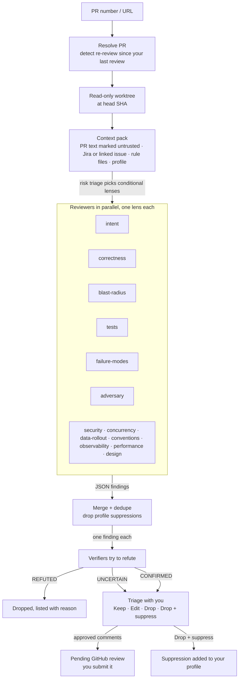

# weston-review

An adversarial, multi-agent PR review plugin for [Claude Code](https://claude.com/claude-code), set up to review the way Weston Jones reviews. Specialist agents each hunt through one lens. An independent verifier tries to refute every finding. The survivors are walked through with you one at a time, and only the comments you approve are posted, as a **pending** review that you submit yourself.

## Install

```
claude plugin marketplace add westonkjones/wes-skills
claude plugin install weston-review@wes-skills
```

It's listed in the [wes-skills](https://github.com/westonkjones/wes-skills) marketplace.

## Use

```
/weston-review:review-pr 1234
/weston-review:review-pr https://github.com/org/repo/pull/1234 --depth deep
/weston-review:review-pr 1234 --lenses security,concurrency
```

Requirements:

- `gh`, authenticated.
- A local clone of the repo, or the skill will clone one.
- Optionally, [`jira-cli`](https://github.com/ankitpokhrel/jira-cli) to pull the linked ticket as the spec.

| Depth | Lenses |
|---|---|
| `quick` | intent, correctness, tests |
| `standard` (default) | the six core lenses, plus any conditional lens whose trigger appears in the diff |
| `deep` | all thirteen lenses; reviewers and verifiers may run tests and repros |

## How it works



Before posting, uncertain findings are turned into questions. On a re-review, only the commits since your last review are examined, and only blocking findings are raised.

### Lenses

| Lens | Asks |
|---|---|
| `intent` | Does it do everything the ticket asked, and nothing it didn't? Reported separately as a coverage table. |
| `correctness` | Is the logic on the changed lines right? |
| `blast-radius` | What outside the diff does it break: callers, contracts, persisted data, other services? |
| `tests` | Would the tests fail if the code were broken? |
| `failure-modes` | Silent failures, timeouts, retries, partial failure, leaks. |
| `adversary` | The strongest case that this should not ship. |
| `security` | Authz, injection, secrets, trust boundaries, with source-to-sink evidence. |
| `concurrency` | Races and idempotency, with a concrete interleaving. |
| `data-rollout` | Migrations, persisted formats, flags, deploy ordering, rollback. |
| `conventions` | The repo's own rule files, patterns and git history. |
| `observability` | Can a failure be diagnosed? No personal data in logs. |
| `performance` | Costs at realistic scale, with evidence of that scale. |
| `design` | Simplest fit for the system. Always non-blocking. |

Every finding must be introduced by the PR and actionable, with evidence and a concrete trigger. Lint and style issues, personal preferences and deliberate behaviour changes are left out. See [`finding-contract.md`](skills/review-pr/references/finding-contract.md).

## Review as yourself

The review's priorities, voice, summary format and suppressions come from a **reviewer profile**. The first of these that exists is used:

1. `<repo>/.claude/review-profile.md`: a per-repo profile.
2. `${CLAUDE_CONFIG_DIR:-~/.claude}/weston-review/profile.md`: your personal profile.
3. [`skills/review-pr/profile/default-profile.md`](skills/review-pr/profile/default-profile.md): Weston's profile.

Copy the default profile to one of the first two locations and edit it. Suppressions you add during triage are written to your personal profile.

## Layout

```
.claude-plugin/        plugin.json
agents/                reviewer.md (one lens), verifier.md (refutes one finding)
skills/review-pr/
  SKILL.md             the orchestration steps
  lenses/              one file per lens
  references/          finding-contract.md, posting.md
  profile/             default-profile.md
```

## License

MIT
